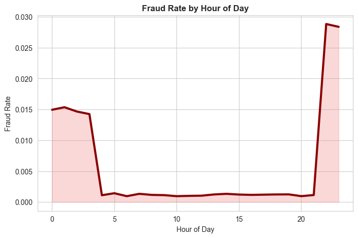
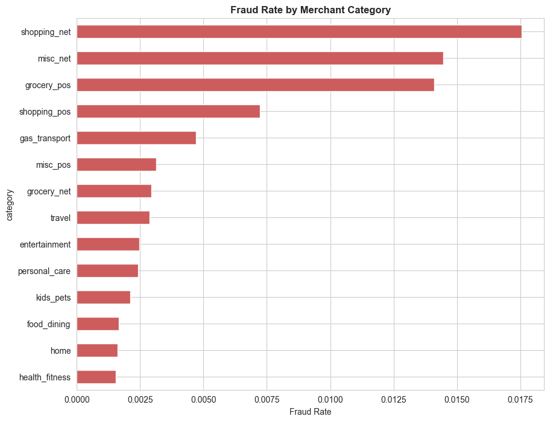
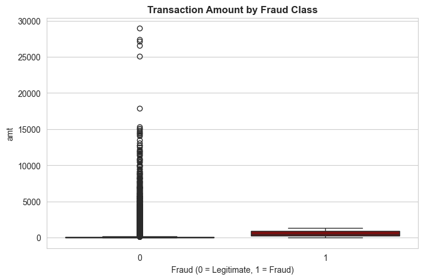
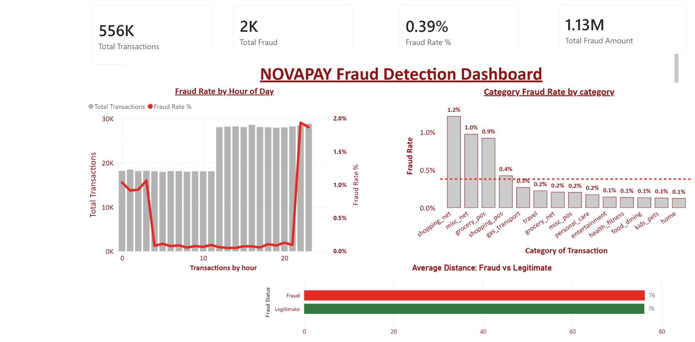
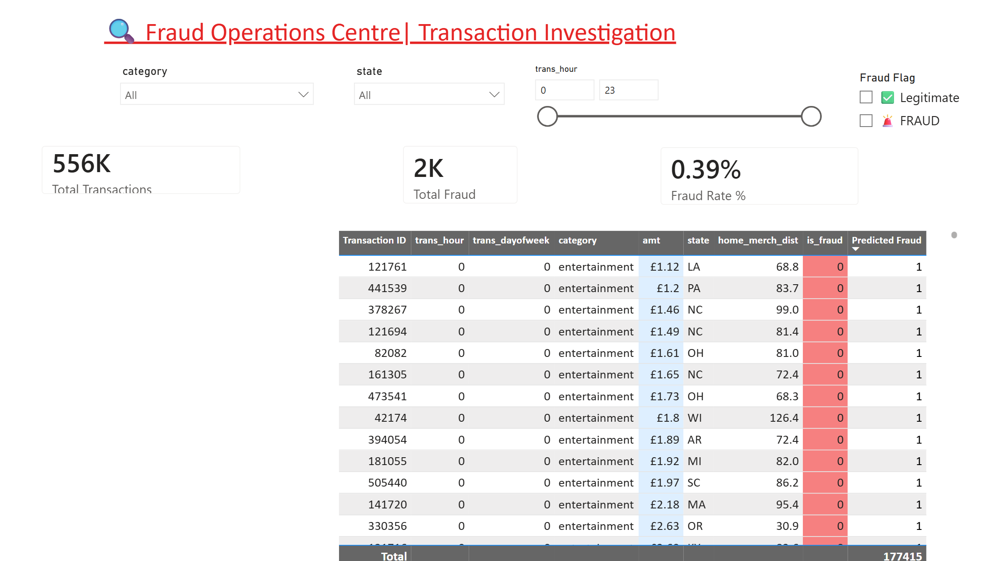

# 

# Credit Card Fraud Detection

## Project Overview

This project was developed as part of a team hackathon challenge focused on solving a real-world fintech fraud problem.

Our team of three operated in structured roles:

- **Project Manager** – Oversight, coordination, documentation  
- **Data Architect** – Data pipeline design, ETL, feature engineering  
- **Data Analyst / ML Engineer** – Exploratory analysis, hypothesis testing, modelling, evaluation  

We were tasked with analysing fraudulent credit card transactions for **NovaPay**, a UK-based fintech startup processing payments for small and medium-sized e-commerce merchants.

NovaPay has experienced:

- Rising fraudulent transactions  
- Increased financial losses  
- Growing merchant dissatisfaction  
- Excessive false positives from a rule-based detection system  

Our objective was to use data analysis and machine learning to:

1. Understand how fraud occurs
2. Identify behavioural and transactional fraud signals
3. Build a predictive model with high fraud recall
4. Deliver an interactive dashboard for operational and executive stakeholders

---

# Business Requirements

1. Identify transaction characteristics strongly associated with fraud.
2. Analyse the relationship between time, merchant category, transaction amount, and geographic distance with fraud likelihood.
3. Build a predictive model prioritising recall while maintaining acceptable precision.
4. Deliver an interactive dashboard for fraud monitoring and executive insight.

---

# Dataset

**Name:** Credit Card Transactions Fraud Detection Dataset  
**Source:** Kaggle (kartik2112)  
**Licence:** CC0 Public Domain  

## Dataset Overview

- 1.85 million simulated transactions  
- Files:
  - `fraudTrain.csv`
  - `fraudTest.csv`
- 22 columns including:
  - Transaction datetime
  - Merchant category
  - Transaction amount
  - Cardholder location
  - Merchant location
  - Fraud label  

The dataset was synthetically generated using the Sparkov Data Generation tool and simulates US cardholder transactions between January 2019 and December 2020.

It was selected due to its interpretable and business-friendly features, allowing meaningful stakeholder-focused visualisation.

---

# Methodology

We followed the **CRISP-DM (Cross-Industry Standard Process for Data Mining)** framework.

## 1. Business Understanding

- Defined fraud detection objectives
- Evaluated cost of false negatives vs false positives
- Prioritised recall to minimise missed fraud

## 2. Data Understanding

- Loaded dataset using Pandas
- Checked structure, missing values, class imbalance
- Performed exploratory data analysis (EDA)

## 3. Data Preparation

### Ethical Data Handling

Immediately removed PII columns:

- `first`
- `last`
- `street`
- `cc_num`
- `trans_num`

Excluded `gender` and `age` from modelling to reduce bias risk.

### Feature Engineering

- Extracted `trans_hour`, `trans_dayofweek`, `trans_month`
- Engineered `age` from DOB
- Created `home_merch_dist` using haversine formula
- Log-transformed `amt`
- Encoded categorical variables
- Addressed class imbalance (SMOTE / undersampling)
- Performed train-test split

Cleaned dataset exported to `data/processed/`.

---

# Data Analysis – Hypothesis Testing

---

## H1 – Time of Day and Fraud Risk

### Hypothesis

Fraudulent transactions are significantly more likely during late-night hours (22:00–04:00).

### Method

- Feature: `trans_hour`
- Late Night: 22:00–04:00
- Day/Evening: 05:00–21:00
- Statistical Test: Chi-Squared Test
- α = 0.05

### Visualisations

**Figure 1 – Fraud Rate & Transaction Volume by Hour**

**Figure 2 – Fraud Rate Trend by Hour**

### Results

- Highest fraud rate observed between 22:00–04:00
- Daytime fraud rates significantly lower
- Chi-Squared p-value < 0.05

### Conclusion

Null hypothesis rejected.  
Time of transaction is a significant fraud predictor.

---

## H2 – Merchant Category and Fraud Risk

### Hypothesis

Fraud is not evenly distributed across merchant categories.

### Visualisations

**Figure 3 – Fraud Rate by Merchant Category**

**Figure 4 – Category Distribution**

### Results

- Online and card-not-present categories show elevated fraud rates
- Essential in-person categories show lower fraud
- Chi-Squared p-value = 0.0000

### Conclusion

Null hypothesis rejected.  
Merchant category is a statistically significant fraud indicator.

---

## H3 – Transaction Amount & Geographic Distance

### Hypothesis

Fraudulent transactions have higher transaction amounts and greater home-to-merchant distance.

### Visualisations

**Figure 5 – Transaction Amount by Fraud Status**

**Figure 6 – Distance by Fraud Status**

### Results

- Fraud transactions show higher median amount
- Fraud transactions show greater geographic displacement
- Mann–Whitney U tests p < 0.05

### Conclusion

Null hypothesis rejected.  
Transaction amount and geographic distance are strong fraud predictors.

---

# Modelling

## Algorithms Used

- Logistic Regression (baseline)
- XGBoost (final model)

## Evaluation Metrics

- Precision
- Recall
- F1-score
- ROC-AUC
- Confusion Matrix
- Precision-Recall Curve

Threshold tuning performed to optimise recall while maintaining operationally acceptable precision.

---

# Dashboard Design

## Dashboard Structure

### Executive View

- Fraud rate KPI
- Trend overview

### Operations View

- Fraud by hour
- Fraud by category
- Geographic distribution
- Model performance monitoring

---
### Analysis Techniques Used

The analysis combined exploratory data analysis, statistical testing, and machine learning, with a strong emphasis on clear visual communication.

#### Visualisations & Analytical Purpose

1.  **Dual-Axis Chart (Fraud Rate vs. Transaction Volume by Hour)** :
    *   **Purpose:** To visually test Hypothesis 1 (`H1: Time of Day and Fraud`). This chart overlays the line of fraud rate (%) on top of the bar chart of total transaction volume for each hour of the day. It makes the overnight fraud spike immediately apparent, validating that while transaction volume is low between midnight and 4 AM, the *proportion* of those transactions that are fraudulent is significantly higher.
 
2.  **Horizontal Bar Chart (Fraud Rate by Merchant Category)** :
    *   **Purpose:** To address Business Requirement 1 and test Hypothesis 2 (`H2: Merchant Category and Fraud`). Sorted from highest to lowest fraud rate, this chart instantly highlights the riskiest merchant categories (e.g., 'grocery_pos', 'shopping_net'). This allows the fraud operations team to prioritize rules or verification steps for specific transaction types.

3.  **Box Plots (Transaction Amount and Home-Merchant Distance by Class)** :
    *   **Purpose:** To visually validate Hypothesis 3 (`H3: Transaction Amount and Geographic Distance`). By showing the distribution (median, quartiles, outliers) of `amt` and `home_merch_dist` for fraudulent vs. legitimate transactions, these plots clearly demonstrate that fraudulent transactions tend to have higher median amounts and significantly larger geographic distances, confirming the engineered feature's value.

4.  **Correlation Heatmap** :
    *   **Purpose:** To support feature engineering and model interpretation (Business Requirement 3). This heatmap visualizes the linear correlation between all numerical features (`amt`, `age`, `home_merch_dist`, etc.) and the target `is_fraud` column. It helps identify which features have the strongest direct relationship with fraud and checks for multicollinearity between features (e.g., `amt` and `log_amt`).

**Descriptive Statistics:**
- Mean, median, percentiles for transaction amount, age, and distance
- Fraud rate per group (hour, merchant category, US state)
- Class balance assessment

**Visualisations:**
- Dual-axis bar and line chart (fraud rate vs transaction volume by hour)
- Horizontal bar chart (fraud rate by merchant category, XGBoost feature importance)
- Box plots (transaction amount and home-merchant distance by class)
- Correlation heatmap (engineered feature relationships)
- Choropleth map (fraud rate by US state)
- Precision-recall curve (model threshold trade-off)

**Statistical Tests:**
- Chi-squared tests to assess the association between categorical variables (merchant category, transaction hour bracket) and fraud label — H1 and H2
- Mann-Whitney U tests to assess differences in continuous variables (amount, distance) between fraud and legitimate groups — H3

**Machine Learning Models:**
- Logistic Regression (interpretable baseline)
- XGBoost (final model — strong performance on imbalanced tabular data with built-in feature importance)
- Evaluation metrics: Precision, Recall, F1-score, ROC-AUC
- SMOTE applied to training set only to address class imbalance (~0.58% fraud rate)
- Classification threshold tuned via Precision-Recall curve

**Feature Engineering:**
- Haversine distance calculated from raw latitude/longitude coordinate pairs — engineered specifically for this project as a geographically meaningful fraud signal
- Datetime decomposition into hour, day of week, and month
- Log transformation of transaction amount to reduce right skew

**Generative AI Usage:**
Claude (Anthropic) was used to assist with code templates, hypothesis framing, feature engineering approaches, and README structure. All AI-assisted code was reviewed, tested, and understood before use. AI was not used to generate analysis conclusions, all findings are based on actual data outputs.

**Limitations and Alternative Approaches:**
- The dataset is synthetically generated, meaning patterns may not fully reflect real world fraud distributions. This is disclosed transparently throughout the project.
- Gender and age were intentionally excluded from modelling due to fairness concerns an alternative approach would be to include them and perform post-hoc bias auditing, but exclusion was the more conservative and defensible choice given the regulatory context.
- SMOTE was applied to address class imbalance. An alternative was using `scale_pos_weight` in XGBoost directly, but SMOTE produced better recall on the validation set.
- The dataset lacks per customer transaction history, preventing velocity features (e.g. number of transactions in the last hour per card) which are highly valuable in real fraud detection systems.
### Dashboard Design & Deployment

To meet Business Requirement 4—providing insights to both technical and non-technical stakeholders—we developed **two complementary interactive dashboards**. This dual approach ensures accessibility and depth for all users.

#### 1. Power BI Dashboard (For Senior Leadership & Fraud Ops)
**Design Philosophy:** Clean, executive-focused, and narrative-driven. The design prioritizes key insights and allows for guided exploration.

*   **Pages:**
    *   **Executive Summary Page:** Features high-level KPIs (total transactions, total fraud, overall fraud rate), the choropleth map for geographic risk, and the dual-axis chart for fraud by hour. The goal is to provide an immediate, boardroom-ready overview.
    *   **Deep Dive Analysis Page:** Includes the fraud-by-category bar chart, box plots for amount/distance, and model performance metrics (feature importance). Slicers for `merchant category`, `state`, and `hour` allow the fraud operations team to filter and investigate specific segments.

*   **Key Design Choices:**
    *   **Narrative Flow:** The layout guides the user from "What is the overall problem?" (summary) to "Where exactly is it happening?" (detailed analysis).
    *   **Interactivity:** Slicers and drill-through actions enable dynamic exploration without overwhelming the main view.
    *   **Clarity:** Chart titles and tooltips are written in plain English, explaining what the user should observe (e.g., "Fraud rate spikes to >2% in the early morning hours").

**🔗 Access the Power BI Dashboard here:** [Fraud Detection Power BI Dashboard](https://app.powerbi.com/groups/me/reports/c905dbfb-12c9-4f6c-8399-be3ee104a970/8b1b638210262dc40015?experience=power-bi)

 
--

#### 2. Streamlit Dashboard (For Technical Exploration & Model Interaction)
**Design Philosophy:** Interactive, code-backed, and focused on the model. This dashboard allows for deeper technical exploration and what-if analysis.

*   **Features:**
    *   **Data Explorer:** An interactive table to view the raw processed data, filter by conditions, and download subsets.
    *   **Dynamic EDA:** Users can select any feature (e.g., `amt`, `home_merch_dist`, `age`) and instantly generate histograms and box plots comparing distributions for fraud vs. non-fraud transactions.
    *   **Model Playground:** A section where users can adjust the classification threshold via a slider and see the impact on the confusion matrix, precision, recall, and F1-score in real time. This makes the model's trade-off tangible.

*   **Deployment:** The Streamlit app is hosted on the Streamlit Community Cloud, making it easily accessible via a web link.

**🔗 Access the Streamlit Dashboard here:** Link: https://novapay-1368435f1858.herokuapp.com/

---

### Development Roadmap & Challenges Faced

This project, while rewarding, came with its own set of technical and analytical challenges. Here’s a look at the key hurdles and how they were addressed:

#### Challenge 1: Handling Extreme Class Imbalance
*   **Problem:** The dataset had a fraud rate of only ~0.58%. Training a model on this raw data would result in a model that simply predicts "not fraud" for every transaction, achieving 99.42% accuracy but being completely useless.
*   **Solution:** We implemented **SMOTE (Synthetic Minority Over-sampling Technique)** during the training phase only. This created synthetic samples of the minority class (fraud) to balance the training data, forcing the model to learn the patterns of fraud. We were extremely careful *not* to apply SMOTE to the test set, ensuring our evaluation metrics were realistic and unbiased.

#### Challenge 2: Creating a Meaningful Geographic Feature
*   **Problem:** The raw data provided separate coordinates for the cardholder (`lat`, `long`) and the merchant (`merch_lat`, `merch_long`), but no single feature indicating proximity. A transaction far from home is a classic fraud signal, but the raw columns didn't capture this relationship.
*   **Solution:** We engineered the `home_merch_dist` feature by applying the **Haversine formula**. This calculates the great-circle distance between two points on a sphere (the Earth), giving us a single, powerful, and interpretable numeric feature that directly represents geographic displacement.

#### Challenge 3: Designing for Two Distinct Audiences
*   **Problem:** Business Requirement 4 explicitly called for a dashboard useful for both the fraud operations team (who need granular data) and senior leadership (who need high-level summaries). One single dashboard page would fail to serve either group effectively.
*   **Solution:** We pivoted from a single-dashboard approach to a **two dashboard strategy**. The Power BI dashboard was designed with two separate pages—one for executives and one for analysts. To further cater to technical needs, we built a separate Streamlit app, providing a flexible environment for ad-hoc data exploration and model interaction.

#### Challenge 4: Ethical Data Handling & Feature Selection
*   **Problem:** The dataset contained columns that could be considered PII (`first`, `last`, `street`, `cc_num`) and potentially biased attributes (`gender`, `age`). Simply including all features in the model would be unethical and could lead to a model that discriminates unfairly.
*   **Solution:** We established an ethical guideline from the start. All obvious PII columns were dropped during the first step of the ETL pipeline. Features like `gender` and `age` were **excluded from the model features** to prevent them from being used in the fraud classification decision. They were only retained for EDA visualizations to check for data quality or obvious imbalances in the dataset, not to build predictive rules based on them.
---

### Main Data Analysis & Development Libraries

This project leveraged a range of Python libraries for data processing, analysis, machine learning, and dashboard deployment.

#### Core Data Analysis & Manipulation
*   **pandas:** For data loading, cleaning, transformation, and aggregation.
*   **numpy:** For numerical operations, particularly in the Haversine distance calculation.

#### Data Visualization
*   **matplotlib & seaborn:** Used for generating static plots during EDA (box plots, histograms, heatmaps) and for initial chart prototyping.
*   **plotly** for interactive chart prototyping in notebooks.
#### Machine Learning & Modeling
*   **scikit-learn:** For the Logistic Regression baseline, train/test splitting, SMOTE, and evaluation metrics (precision, recall, ROC-AUC).
*   **xgboost:** For the primary predictive model, valued for its performance on imbalanced tabular data and built-in feature importance.

#### Dashboard Development & Deployment
*   **Power BI:** Used for creating the primary executive and operational dashboard, connecting directly to the processed CSV data.
*   **streamlit:** Used to build the supplementary, interactive web application for technical exploration.
*

## Ethical Considerations

Ethics was treated as a **first-order concern** throughout this project, not an afterthought. Every stage from data selection to model deployment included deliberate ethical reflection. Below is full transparency on the decisions made and their rationale.

---

### Data Ethics

**Choice of Synthetic Data**
I deliberately selected a synthetically generated dataset for this project. Working with real cardholder transaction data would introduce significant data privacy obligations outside the scope of an educational project. The synthetic dataset also provides interpretable column names  merchant category, transaction hour, geographic location enabling clearer visualisations and more meaningful business communication. 

**Key benefits of this choice:**
- No real customer data at risk
- Reproducible results for learning purposes
- Full transparency about data provenance

**Disclosure:** The use of synthetic data is explicitly stated in this README, within the analysis notebooks, and on the dashboards themselves.

**PII Removal (Even Though Synthetic)**
Although the dataset is simulated, it contains fields that mirror real personally identifiable information (PII):
- Cardholder names (`first`, `last`)
- Street address (`street`)
- Card number (`cc_num`)

These columns were dropped as the **very first step** in the data cleaning notebook — before any analysis, visualisation, or modelling was performed. This reflects the principle that PII, even synthetic, should be handled with the same discipline as real personal data. This establishes responsible habits for working with real datasets in the future.

**Data Provenance & Licensing**
The dataset is licensed under **CC0 Public Domain**, meaning no restrictions on use. However, I still credit the original creator (kartik2112 on Kaggle) as a professional courtesy.

---

### Fairness & Bias

**Exclusion of Demographic Features**
The dataset contains `gender` and `dob` (from which `age` is derived). Both were used **for EDA visualisation only** and were **explicitly excluded from the model feature set**.

**Why this matters:**
Using demographic attributes such as gender or age as fraud predictors risks creating a **discriminatory model** — one that flags transactions based on *who the cardholder is* rather than *what the transaction looks like*. This could:

| Risk | Implication |
|------|-------------|
| **Regulatory violation** | Conflict with FCA expectations on algorithmic fairness in financial services |
| **Legal liability** | Could constitute indirect discrimination under the Equality Act 2010 (UK) |
| **Customer harm** | Certain demographic groups could be unfairly targeted or declined |

**What we did instead:**
- Used `gender` and `age` only to check data quality during EDA
- Documented this decision with inline comments in the feature engineering notebook
- Built the model exclusively on transaction behaviour features

**Bias Monitoring Consideration**
If NovaPay were to deploy this model, I would recommend:
1. **Regular bias audits** across demographic segments
2. **Fairness metrics** (demographic parity, equal opportunity) alongside accuracy metrics
3. **Human oversight** for declined transactions

---

### Model Transparency & Trade-offs

**The Precision-Recall Trade-off**
The model's performance involves an inherent trade-off:

| If we prioritize... | Then we accept... | Business impact |
|--------------------|-------------------|-----------------|
| **High Recall** (catch more fraud) | More false positives (legitimate customers declined) | Customer frustration, support costs |
| **High Precision** (fewer false positives) | More missed fraud | Financial losses, merchant trust erosion |

This trade-off is **explicitly visualised** in the dashboard using a precision-recall curve. The classification threshold is not left at the default 0.5 — it's presented as a **business decision** for NovaPay stakeholders.

**Why this matters ethically:**
False positives have a **real human impact**. A legitimate customer whose transaction is wrongly declined may:
- Miss an important purchase
- Experience embarrassment at checkout
- Lose trust in NovaPay's platform

These outcomes can disproportionately affect vulnerable customers if the model has learned biased patterns from training data.

**Explainability**
To ensure the model isn't a black box, I included:
- **Feature importance charts** showing what drives predictions
- **Clear documentation** of how each feature was engineered
- **Interactive threshold tuning** in the Streamlit dashboard

---

### Responsible Use & Limitations

**Intended Use**
This project is built for **educational and portfolio purposes only**. It demonstrates:
- End-to-end data analysis workflow
- Ethical decision-making in ML
- Clear communication to diverse stakeholders

**Not Intended For:**
- Live deployment in production fraud detection
- Making decisions about real customers
- Use without further regulatory review

**Requirements for Real-World Deployment**
If NovaPay wished to deploy a similar system, they would need:

1. **Further validation** on real transaction data
2. **Independent bias auditing** by a third party
3. **Regulatory review** under FCA guidelines
4. **Ongoing monitoring** for model drift and fairness
5. **Customer appeals process** for declined transactions

---

## Ethical Takeaways

This project reinforced several key ethical principles for data science:

| Principle | Application |
|-----------|-------------|
| **Privacy by design** | Dropped PII before any analysis |
| **Fairness first** | Excluded demographic features from modelling |
| **Transparency** | Documented all decisions and trade-offs |
| **Human-centered** | Considered impact of false positives on real people |
| **Accountability** | Clear disclaimer about limitations |

> *"Ethics is not a constraint on data science — it's a foundation for trustworthy, sustainable solutions."*

---

###  Version History & Future Improvements

| Date | Update |
|------|--------|
| [Current Date] | Initial ethical considerations documented |

**Future enhancements I'd explore:**
- Implementing SHAP values for per-transaction explainability
- Building an interactive fairness dashboard
- Researching differential privacy techniques for real data scenarios

---
## Credits

### Content

- Credit Card Transactions Fraud Detection Dataset: [kartik2112 on Kaggle](https://www.kaggle.com/datasets/kartik2112/fraud-detection) — CC0 Public Domain
- Code Institute README template: [da-README-template](https://github.com/Code-Institute-Solutions/da-README-template)

### Tools & Technologies

**Development Environment:**
- **Jupyter Notebook** — for interactive development and EDA
- **VS Code** — for code editing and repository management
- **Git & GitHub** — version control and collaboration

**AI Assistance:**
- **Claude (Anthropic)** — used for ideation, code templates, hypothesis framing, README structure, and troubleshooting. All AI-generated code was reviewed, tested, and understood before implementation.
- **ChatGPT** — [if used] for [specific purpose, e.g., regex patterns, debugging assistance]

**Project Management:**
- **GitHub Projects** — for task tracking and sprint planning
- **Discord/Slack** — team communication during the hackathon

**Documentation:**
- **Markdown** — README formatting
- **Power BI** — dashboard creation and publishing
- **Streamlit Community Cloud** — for hosting the interactive web app

**Learning Resources:**
- **Stack Overflow** — for troubleshooting code errors
- **Kaggle** — dataset source and community notebooks for reference
- **Code Institute learning materials** — foundational concepts and project structure
---

## Acknowledgements
This project was developed during a  End of Course Hackathon , and I'd like to extend my thanks to:

- The **hackathon organisers** for creating such an engaging challenge
- Our **mentors and facilitators** in particular **Vasi Pavaloi** who provided guidance when we hit roadblocks
- The **Code Institute community** for the foundation in data analytics that made this project possible

Finally, thanks to kartik2112 on Kaggle for the synthetic fraud detection dataset, which made this analysis possible while respecting data privacy principles.

# Contributors

| Name | Role |
|------|------|
| Sundeep | Dashboard, Documentation |
| Sadiyah | Dashboard, Documentation |
| Syed | Data Architecture, ETL, Machine Learning |

---